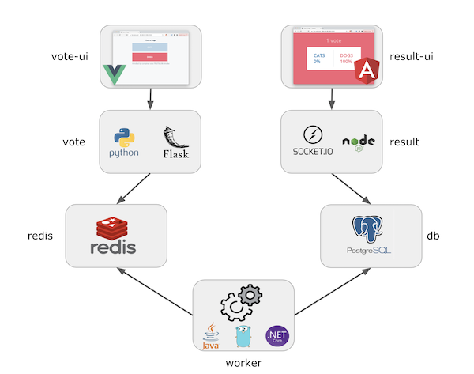
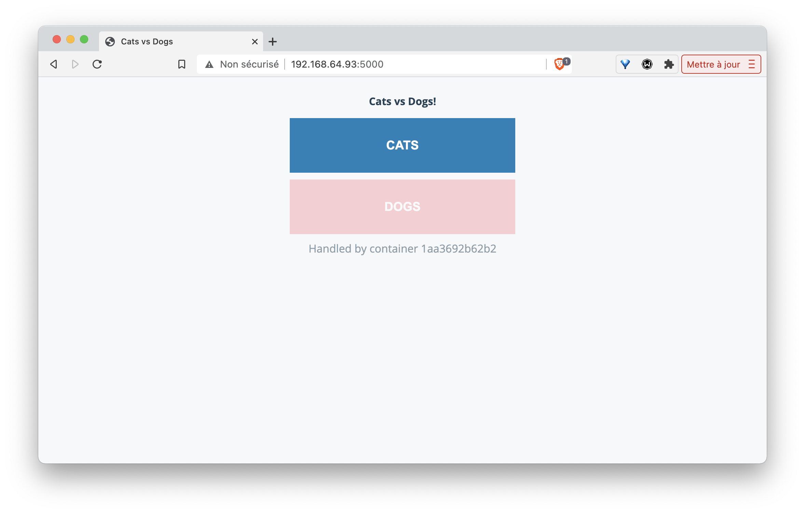
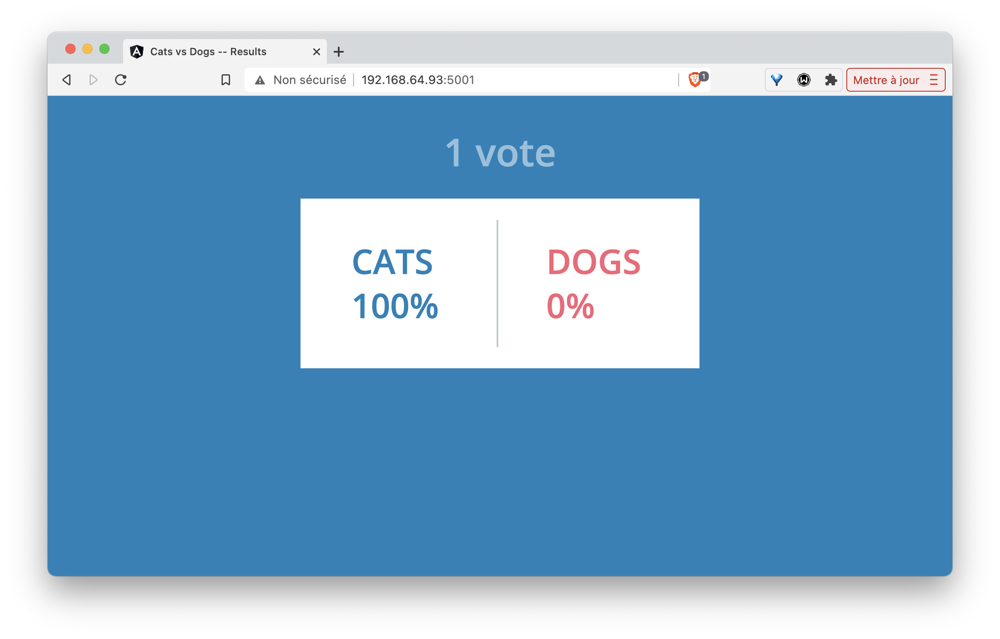

# Voting application

In this exercise, we will illustrate the use of *Docker Compose* and launch the *Voting App*. This application is widely used for presentations and demos, it is a good example of a simple microservices application.

## Overview

The *Voting App* application is composed of several microservices, those used for version 2 are the following:



* vote-ui: front-end allowing a user to vote between 2 options
* vote: back-end receiving the votes
* result-ui: front-end for viewing the results
* result: back-end providing the results
* redis: redis database where votes are stored
* worker: service that retrieves the votes from redis and consolidates the results in a postgres database
* db: postgres database where the results are stored

## Retrieving GitLab repos

Run the following commands to retrieve the repo of each microservice and the configuration repo:

```
mkdir VotingApp && cd VotingApp
for project in config vote vote-ui result result-ui worker; do
  git clone https://gitlab.com/voting-application/$project
done
```

## The compose.yaml file format

Several files, in Docker Compose format, are available in *config/compose*:

- *compose.dev.yaml* is used to launch the application for a development context
- *compose.yaml* is used to build the images of each microservice for a production context

## Launching the application

From the *config/compose* directory, launch the application with the following command (the *compose.yaml* file will be used by default):

```
docker compose up -d
```

The steps performed when launching the application are as follows:
* creation of front-tier and back-tier networks
* creation of the db-data volume
* building images for the services *vote-ui*, *vote*, *result-ui*, *result*, *worker* and retrieving images *redis* and *postgres* * launching containers for each service
* launch containers for each service

Note: a reserve proxy based on Traefik will also be launched but it will not be used in this exercise.

## The containers launched

With the following command, list the containers that have been launched and make sure they are all in *Up* status:

```
docker compose ps
```

## Created volumes

List the volumes with the CLI, and check that the volume defined in the *docker-compose.yml* file is present.

```
docker volume ls
```

The volume name is prefixed with the name of the directory where the application was launched.

```
DRIVER VOLUME NAME
local compose_db-data
...
```

By default this volume corresponds to a directory created on the host machine.

## Created networks

List the networks with the CLI. The two networks defined in the *docker-compose.yml* file are present.

```
docker network ls
```

As with the volume, their names are prefixed by the directory name.

```
NETWORK ID NAME DRIVER SCOPE
71d0f64882d5 bridge bridge local
409bc6998857 compose_back-tier bridge local
b3858656638b compose_front-tier bridge local
2f00536eb085 host host local
54dee0283ab4 none null local
```

Note: as we are in the context of a single host, the driver used to create these networks is of the bridge type. It allows communication between containers running on the same machine.

## Using the application

We can now access the application:

we make a choice between the 2 options from the voting interface at http://HOST_IP:5000 



we visualize the result from the result interface at http://HOST_IP:5001



Note: replace HOST_IP by localhost or by the IP address of the machine on which the application was launched

## Scaling the worker service

By default, a container is launched for each service. It is possible, with the *--scale* option, to change this behavior and to scale a service once it is launched.

With the following command, increase the number of workers to 2.

```
docker compose up -d --scale worker=2
```

Check that there are now 2 containers for the worker service:

```
docker compose ps
```

Notes: it is not possible to scale the *vote-ui* and *result-ui* services because they both specify a port, multiple containers cannot use the same host machine port

## Removing the application

With the following command, stop the application. This command deletes all previously created items except for volumes (so as not to lose data)

```
docker compose down
```

In order to delete also the used volumes, you have to add the *-v* flag:

```
docker compose down -v
```