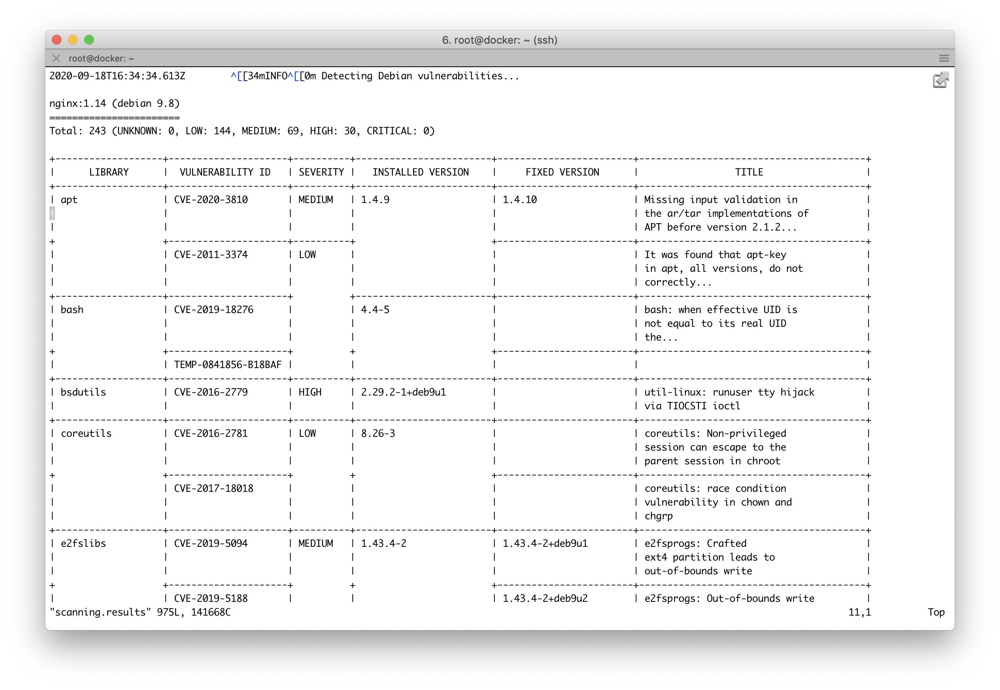
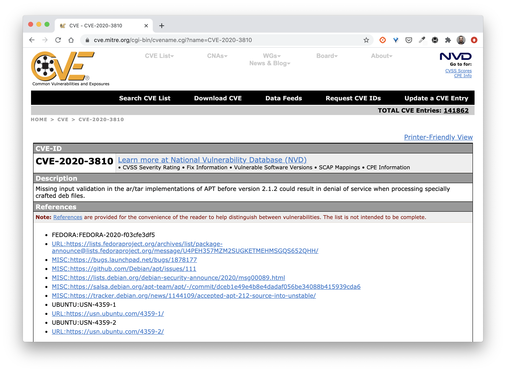

Dans cet exercice, vous allez utiliser le scanner de vulnérabilités *Trivy* pour scanner une image de votre choix.

Vous trouverez davantage d'information sur ce projet dans son repository Github: [https://github.com/aquasecurity/trivy](https://github.com/aquasecurity/trivy)

## Installation

Installez *Trivy* en utilisant la commande suivante:

```
$ curl -sfL https://raw.githubusercontent.com/aquasecurity/trivy/master/contrib/install.sh | sh -s -- -b /usr/local/bin
```

## Scanning d'une image

Lancez simplement Trivy sur une image de votre choix

```
$ trivy image IMAGE_NAME
```

Exemple du scanning de l'image *nginx:1.14*



Vous obtiendrez alors la liste des vulnérabilités qui ont été détectées dans cette image.
Chacune de ces vulnérabilités a une référence qui vous permettra d'en savoir plus sur le site [https://cve.mitre/org](https://cve.mitre.org)

Information obtenues concernant la vulnérabilité *CVE-2020-3810* détectée sur l'image *nginx:1.14*.


